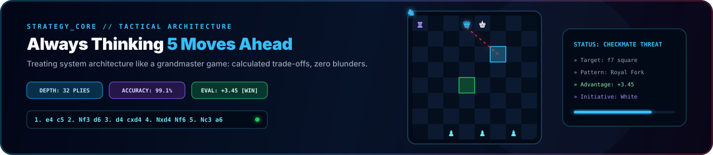

  

  

# Hi, I'm Segun Arulogun Gabriel (Shigosag)

Segun Arulogun Gabriel, known as Shigosag, is an entrepreneur, civil engineering graduate, forex trader, self-taught software developer, and chess enthusiast.

💻 AI-Assisted Software Developer  
🚀 Building AI-assisted web, mobile, desktop applications, automation systems and modern digital Solutions
🧠 Passionate about technology, business, AI, and problem-solving

## 🔥 Skills
- Web, Mobile, and Desktop Development
- AI-Assisted Development
- Automation
- CLI Applications
- Problem Solving & Logical Systems
- Git & GitHub

## 🛠️ Current Focus
- Building real-world software projects
- AI-powered development workflows
- Automation and productivity tools
- AI Tools Integration
- Improving software development skills through practice

## 📚 Background

- Civil Engineering graduate from The Polytechnic Ibadan
- Experience in entrepreneurship and business operations
- Customer experience auditing in the banking sector
- Self-taught programmer (learning through freeCodeCamp and practical projects)

## 💡 Interests

- Artificial Intelligence
- Software Development
- Automation Systems
- Entrepreneurship
- Chess
- Continuous Learning

## 📫 Connect
- GitHub: https://github.com/Shigosag

<!---
Shigosag/Shigosag is a ✨ special ✨ repository because its `README.md` (this file) appears on your GitHub profile.
You can click the Preview link to take a look at your changes.
--->
